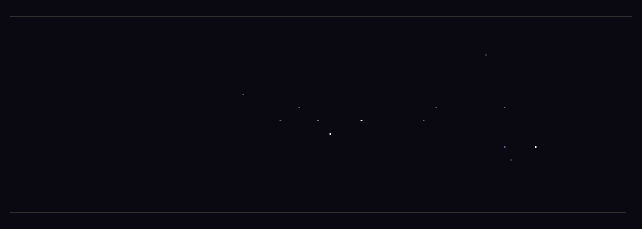

# 747 Terminal Games

**Play a game in your terminal while your AI codes.**

When Claude Code is thinking, a little game appears in a pane beside your work. It **pauses the instant Claude replies** so you never miss the answer, and **resumes when you send your next prompt**. Close it any time. Zero setup beyond installing the plugin — the pause/resume is wired automatically.



Title #1 is **Breakout 747** — the brick-and-paddle classic, in your terminal.

```
 BREAKOUT · SCORE 120 · LIVES ♥♥♥ · LVL 1
 ▄▄▄▄▄ ▄▄▄▄▄ ▄▄▄▄▄ ▄▄▄▄▄ ▄▄▄▄▄ ▄▄▄▄▄ ▄▄▄▄▄ ▄▄▄▄▄
 ▄▄▄▄▄ ▄▄▄▄▄ ▄▄▄▄▄ ▄▄▄▄▄ ▄▄▄▄▄ ▄▄▄▄▄ ▄▄▄▄▄ ▄▄▄▄▄
 ▄▄▄▄▄ ▄▄▄▄▄ ▄▄▄▄▄ ▄▄▄▄▄ ▄▄▄▄▄ ▄▄▄▄▄ ▄▄▄▄▄ ▄▄▄▄▄
 ▄▄▄▄▄ ▄▄▄▄▄ ▄▄▄▄▄ ▄▄▄▄▄ ▄▄▄▄▄ ▄▄▄▄▄ ▄▄▄▄▄ ▄▄▄▄▄
                    ●
              ▀▀▀▀▀▀▀▀▀▀▀▀
```

## Install (Claude Code plugin)

```
/plugin marketplace add The747Lab/747-terminal-games
/plugin install 747-terminal-games
```

That's it. The next time Claude thinks, you'll be asked once whether you want to play — `y` to try it, `a` to auto-open every time, `o` to never ask.

## Play

- **Move the paddle:** `←` / `→` (or `a` / `d`), or your mouse.
- **`space`** — keep playing even after Claude replies (or pause).
- **`q`** — close the game.
- **`/breakout`** — open it any time for a free-play round (ignores Claude's state).

## Requirements

- **tmux** — the game opens as a split pane in your tmux window. (Running Claude Code inside tmux is all you need.)
- **Python 3** with `curses` (standard on macOS and Linux).

## Modes

A tiny file at `~/.747-terminal-games/mode` controls auto-launch:

| Value  | Behavior                                  |
|--------|-------------------------------------------|
| `ask`  | Ask once per session (default)            |
| `auto` | Always open while Claude thinks           |
| `off`  | Never auto-open (`/breakout` still works) |

## About

Built by [The 747 Lab](https://github.com/The747Lab). First title in a growing line of terminal games. There may or may not be a `747` hidden in each one.

MIT licensed. PRs and new games welcome.
